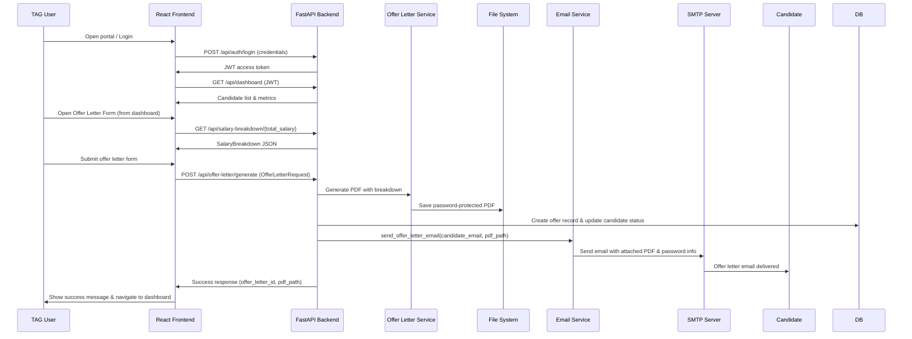

## 1. Introduction

### 1.1 Purpose
This document describes the solution design for the **Employee Offer Management Portal** used by the TAG (Talent Acquisition Group) team to create, manage, and send offer letters to candidates.

### 1.2 Scope
- Web portal for TAG members to:
  - Authenticate using individual logins.
  - View and manage their assigned candidates.
  - Capture all details required for an offer letter.
  - Automatically calculate salary breakup from a single total salary input.
  - Generate a password‑protected offer letter PDF in the standard company format.
  - **Send the generated offer letter via email to the candidate as the final step of the workflow.**

## 2. High‑Level Architecture

### 2.0 Architecture Diagram (Logical)

The following diagram can be pasted into your documentation tool as an architecture reference. In Markdown‑aware tools you can render it directly; in Word, you can recreate it using SmartArt or shapes.

```mermaid
flowchart LR
    User[TAG Member<br/>Browser] --> FE[React Frontend<br/>(Vite, Tailwind, Framer Motion)]
    FE -->|JWT over HTTPS| API[FastAPI Backend<br/>(main.py)]

    API --> AUTH[Auth Service<br/>(auth.py)]
    API --> DB[In‑Memory Data Layer<br/>(database.py)]
    API --> PDF[Offer Letter Service<br/>(offer_letter_service.py)]
    API --> EMAIL[Email Service<br/>(email_service.py)]

    PDF --> FS[(File System<br/>generated_offer_letters/)]
    EMAIL --> SMTP[(SMTP Server<br/>(Corp Mail / O365 / Gmail))]
```

### 2.1 Logical Architecture
- **Client (Frontend) – React**
  - SPA built with React + Vite.
  - Teal‑themed, modern UI with animations (Framer Motion) and Tailwind CSS.
  - Pages:
    - Login
    - Dashboard
    - Offer Letter Form (multi‑step)
- **API Layer (Backend) – Python FastAPI**
  - REST APIs for authentication, dashboard data, offer generation, and salary breakdown.
  - In‑memory data store for TAG users, candidates, and offer records (can be replaced with DB later).
  - Services:
    - Authentication / JWT issuing.
    - Offer letter PDF generation with salary breakdown.
    - Email service (SMTP based) to send offer PDFs.
- **External Services**
  - SMTP server (e.g., corporate mail or Office 365 / Gmail) for sending emails.

### 2.2 Deployment View
- **Backend**
  - FastAPI app hosted on an application server (VM / container).
  - Exposes HTTP APIs (e.g., `https://<host>/api/...`).
- **Frontend**
  - Static build (Vite) hosted behind a web server (e.g., Nginx, IIS, or cloud static hosting).
  - Communicates with backend via HTTPS.

## 3. Detailed Component Design

### 3.1 Frontend Components

#### 3.1.1 Login Page
- **Layout**
  - Full‑screen background with professional teal / slate gradient and subtle animated shapes.
  - Left panel (desktop):
    - `ValueMomentum_logo.png`.
    - Title: **Employee Offer Management Portal**.
    - Supporting tagline.
  - Right panel:
    - Glassmorphism login card (transparent, blurred).
    - Fields: Username/Email, Password.
    - Actions: Login button, “Forgot Password?” (non‑functional placeholder).
    - Test credentials section for TAG demo accounts.
- **Behaviour**
  - On submit, calls `POST /api/auth/login`.
  - Stores `access_token` (JWT) and user info in `localStorage`.
  - Navigates to dashboard on success.

#### 3.1.2 Dashboard
- Shows summary metrics:
  - Total candidates, Pending offers, Sent offers.
- Candidate table:
  - Name, email, position, status, offer date, “Send Offer” action for Pending candidates.
- Visuals:
  - Animated stat cards.
  - Pie chart of Pending vs Sent offers.
- Behaviour:
  - On load, calls `GET /api/dashboard`.
  - Clicking **Send Offer** navigates to Offer Letter Form with candidate pre‑filled.

#### 3.1.3 Offer Letter Form
- **Sections (multi‑step wizard):**
  1. Candidate information
     - Name, email, phone, address.
  2. Position details
     - Position, department, work location, reporting manager, employment type, joining date, probation period, notice period.
  3. Compensation
     - Total annual salary (single number input by TAG).
     - Auto‑calculated salary breakdown (basic, HRA, allowances, deductions, net pay).
  4. Additional info
     - Benefits (optional).
     - Custom terms & conditions (optional).
- **Behaviour**
  - When total salary changes, calls `GET /api/salary-breakdown/{total_salary}` to display breakdown.
  - On submit, calls `POST /api/offer-letter/generate`.
  - On success:
    - Shows success toast.
    - Navigates back to dashboard.

### 3.2 Backend Components

#### 3.2.1 Authentication (`auth.py`)
- Static TAG user store (`USERS_DB`) with usernames and passwords for:
  - `tag_user1`, `tag_user2`, `tag_user3`.
- Issues JWT tokens (`create_access_token`) with:
  - `sub` (username), `role`, expiry.
- FastAPI dependencies:
  - `verify_token` – validates JWT from `Authorization: Bearer <token>`.
  - `get_current_user` – resolves `User` object for API handlers.

#### 3.2.2 Data Layer (`database.py`)
- In‑memory dictionaries:
  - `CANDIDATES_DB[username]` – list of candidate objects per TAG user.
  - `OFFER_LETTERS_DB[username]` – list of offer letter records created by user.
- Methods:
  - `get_candidates_by_user(username)`.
  - `create_offer_letter_record(username, offer_data, salary_breakdown, pdf_path)` – also updates candidate status to “Offer Sent” and sets `offer_date`.
  - `get_offer_letters_by_user(username)`.

#### 3.2.3 Models (`models.py`)
- `OfferLetterRequest`
  - All form fields captured from frontend.
- `SalaryBreakdown`
  - Components: basic, HRA, special allowance, transport, medical, PF, professional tax, total deductions, net salary.

#### 3.2.4 Offer Letter Service (`offer_letter_service.py`)
- `calculate_salary_breakdown(total_salary: float) -> SalaryBreakdown`
  - Basic: 50% of total.
  - HRA: 40% of basic.
  - Transport: 2% of total.
  - Medical: 1% of total.
  - Special allowance: balancing component.
  - PF: 12% of basic.
  - Professional tax: fixed value.
  - Computes total deductions and net salary.
- `generate_offer_letter_pdf(offer_data, salary_breakdown, created_by) -> str`
  - Renders a company‑formatted offer letter using ReportLab:
    - Company branding, candidate details, position details, salary table, terms & conditions, signatures.
  - Saves a PDF file under `backend/generated_offer_letters/`.
  - Calls `password_protect_pdf(pdf_path)` to encrypt file.
- `password_protect_pdf(pdf_path, password='Offer2024')`
  - Uses `pypdf` to encrypt PDF with a password (default, or can be customised).

#### 3.2.5 Email Service (`email_service.py`)
- Reads SMTP configuration from `.env`:
  - `SMTP_SERVER`, `SMTP_PORT`, `SMTP_USERNAME`, `SMTP_PASSWORD`, `FROM_EMAIL`.
- `send_offer_letter_email(candidate_email, pdf_path, candidate_name)`
  - Builds an email with:
    - Subject: “Offer Letter - Welcome to Our Team”.
    - Body: greeting, brief instructions, and **explicit mention of the PDF password** (e.g., `Offer2024`).
    - Attachment: the generated, password‑protected offer letter PDF.
  - Sends via SMTP using TLS.
  - If SMTP is not configured, logs a message and skips sending (non‑blocking).

### 3.3 API Design (`main.py`)

- `POST /api/auth/login`
  - Request: `{ username, password }`.
  - Response: `{ access_token, token_type, user }`.
  - Validates credentials and returns JWT.

- `GET /api/dashboard`
  - Auth required.
  - Returns:
    - User info.
    - Candidate list for TAG member.
    - Counts of total, pending, and sent offers.

- `GET /api/salary-breakdown/{total_salary}`
  - Computes salary breakdown for UI display.

- `POST /api/offer-letter/generate`
  - Auth required.
  - Request: `OfferLetterRequest`.
  - Flow:
    1. Compute salary breakdown.
    2. Generate password‑protected PDF.
    3. Persist offer record and update candidate status.
    4. **Trigger email sending to candidate with attached PDF as the final step.**
       - Email step is wrapped in a `try/except` so that PDF generation does not fail if email sending fails.
  - Response: `{ success, message, offer_letter_id, pdf_path }`.

- `GET /api/offer-letters`
  - Auth required.
  - Returns all offers created by the logged‑in user.

## 4. End‑to‑End Process Flows

### 4.0 End‑to‑End Flow Diagram



### 4.1 Login Flow
1. TAG member opens portal and sees the login screen (logo + title on left, login card on right).
2. Enters username and password and clicks **LOGIN**.
3. Frontend calls `POST /api/auth/login`.
4. Backend validates user and returns JWT.
5. Frontend stores JWT and navigates to Dashboard.

### 4.2 Dashboard & Candidate Management Flow
1. On Dashboard load, frontend calls `GET /api/dashboard` with JWT.
2. Backend returns candidate list and counts.
3. TAG member can:
   - View statuses and offer dates.
   - Click **Send Offer** on a Pending candidate to open the Offer Letter Form with candidate data pre‑filled.

### 4.3 Offer Letter Generation & Email Sending Flow
1. TAG member opens Offer Letter Form:
   - Candidate info pre‑filled if coming from Dashboard, or entered manually.
2. Enters/updates:
   - Candidate details, position details, joining date, work location, manager, probation/notice, etc.
3. Enters **Total Annual Salary** only.
4. UI calls `GET /api/salary-breakdown/{total_salary}` to display computed breakdown.
5. TAG member fills optional benefits and terms and submits the form.
6. Frontend calls `POST /api/offer-letter/generate` with full payload.
7. Backend:
   - Computes salary breakdown again for consistency.
   - Generates a branded PDF and password‑protects it.
   - Saves file path and details in `OFFER_LETTERS_DB`.
   - Updates candidate status to **Offer Sent** and sets offer date.
   - **Final Step – Email Sending:**
     - Calls `send_offer_letter_email(candidate_email, pdf_path, candidate_name)`.
     - Email includes:
       - Greeting and basic instructions.
       - Attached password‑protected PDF.
       - Password instructions (e.g., `Password: Offer2024`).
8. Backend returns success response; frontend shows a success toast and returns to Dashboard.

## 5. Security Considerations

- **Authentication & Authorization**
  - All sensitive APIs require JWT bearer token.
  - Only authenticated TAG users can access dashboard and offer APIs.
- **PDF Protection**
  - Offer letter PDFs are encrypted with a password to prevent unauthorised access.
  - Password policy can be changed later (e.g., candidate DOB, last 4 of phone, etc.).
- **Transport Security**
  - Recommended to serve both frontend and backend over HTTPS in production.
- **Secrets Management**
  - SMTP credentials and JWT secret stored in environment variables / `.env`.
- **Data Privacy**
  - Candidate data is currently in memory for demo; in production, use a secure database with proper access controls and auditing.

## 6. Non‑Functional Requirements

- **Performance**
  - PDF generation and email sending are performed per request; email failure does not block PDF creation.
- **Scalability**
  - FastAPI backend and React frontend can be containerised and scaled horizontally.
- **Usability**
  - Modern, responsive UI with clear guided steps and automatic salary breakdown.
- **Extensibility**
  - Data layer can be swapped to a real database (PostgreSQL, SQL Server, etc.).
  - Easy to integrate with corporate SSO / AD for authentication in future.

## 7. Future Enhancements

- Integrate with corporate Active Directory / SSO for authentication.
- Store offer letters and candidate data in a relational database.
- Configurable salary breakup rules per country / band.
- Audit trail for all offer actions.
- Support for offer revisions and versioning.
- Multi‑language and multi‑currency support.

